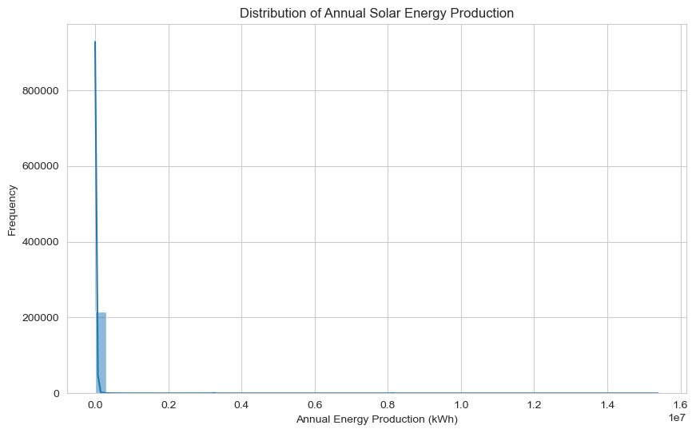
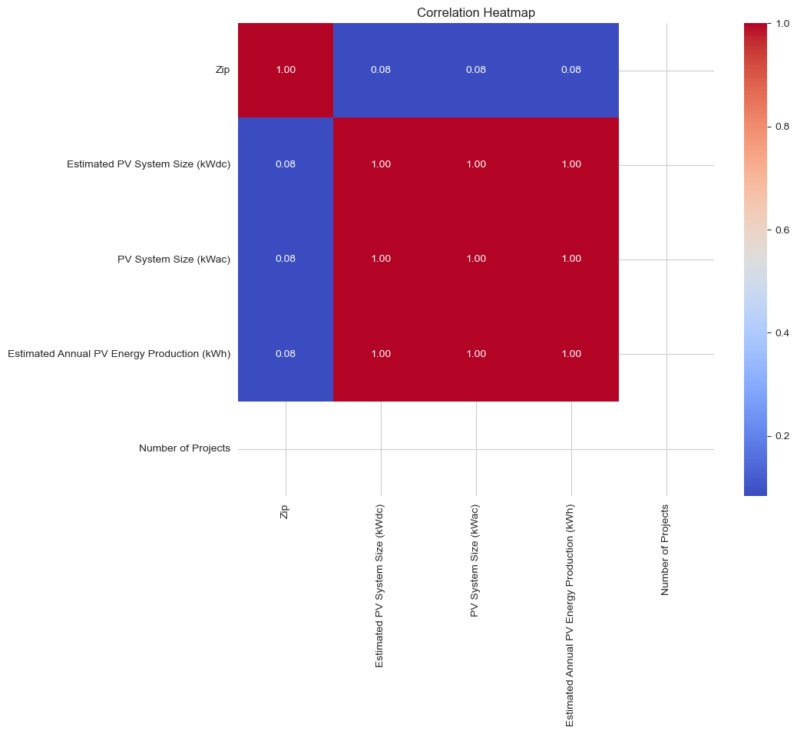
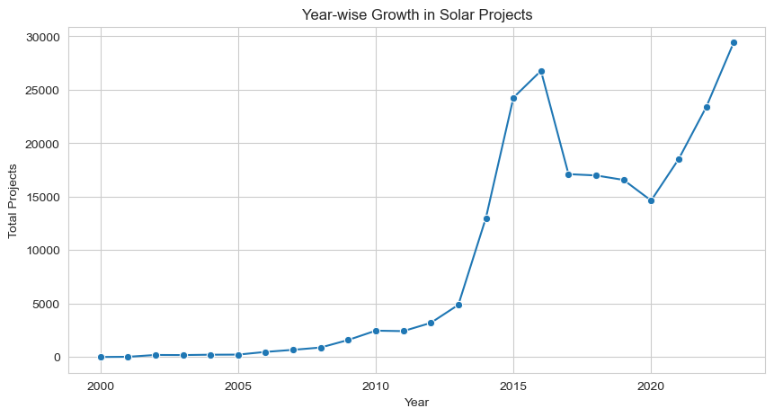
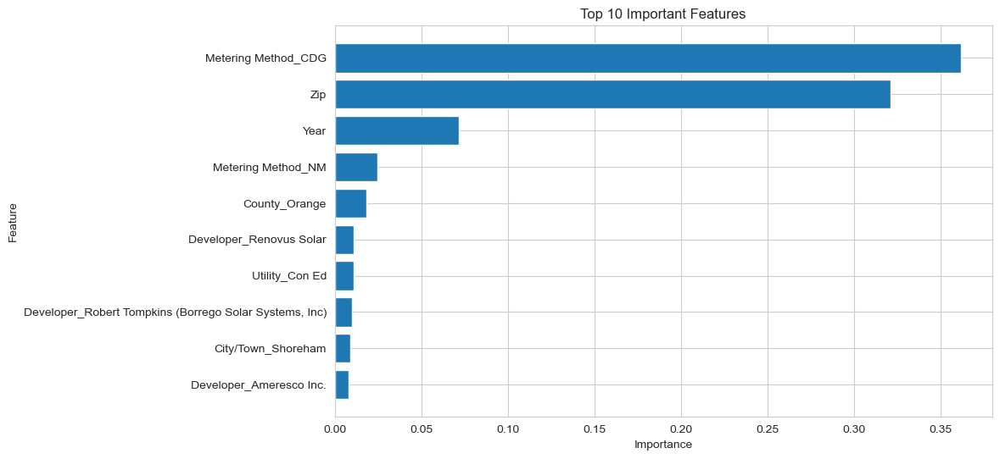

# ☀️ Solar Energy Production Prediction Using Machine Learning


---

# 📌 Project Overview

Solar energy has become one of the fastest-growing renewable energy sources worldwide. Accurately estimating future solar energy production helps utility companies, policymakers, and energy providers optimize infrastructure planning, grid management, and investment decisions.

This project develops an end-to-end Machine Learning regression pipeline to predict annual solar energy production using historical solar installation data, system characteristics, and geographical information.

The complete workflow includes:

- Data Collection
- Data Cleaning
- Exploratory Data Analysis (EDA)
- Feature Engineering
- Data Preprocessing
- Model Training
- Hyperparameter Tuning
- Model Evaluation
- Feature Importance Analysis
- Prediction
- Model Serialization

---

# 🎯 Business Problem

Predicting solar energy production enables organizations to estimate future power generation, optimize renewable energy investments, and improve long-term energy planning.

Reliable predictions support:

- Renewable Energy Planning
- Grid Optimization
- Investment Analysis
- Energy Policy Decisions
- Capacity Forecasting

---

# 📊 Dataset Information

The dataset contains historical information about solar installations including:

- Utility
- City/Town
- County
- Circuit ID
- Metering Method
- Estimated PV System Size
- ZIP Code
- Number of Projects
- Year
- Month

**Target Variable**

Estimated Annual PV Energy Production (kWh)

---

# 🛠 Technologies Used

- Python
- Pandas
- NumPy
- Matplotlib
- Seaborn
- Scikit-learn
- Joblib
- Jupyter Notebook

---

# ⚙ Machine Learning Workflow

1. Data Collection
2. Data Cleaning
3. Exploratory Data Analysis
4. Feature Engineering
5. One-Hot Encoding
6. Feature Scaling
7. Model Training
8. Hyperparameter Tuning
9. Model Evaluation
10. Feature Importance Analysis
11. Prediction
12. Model Saving

---

# 📈 Exploratory Data Analysis

The notebook includes:

- Feature Distribution Analysis
- Correlation Heatmap
- Year-wise Project Analysis
- Data Quality Checks
- Feature Importance Visualization

---

# 📊 Project Visualizations

## Annual Energy Production Distribution



---

## Correlation Heatmap



---

## Year-wise Solar Projects



---

## Feature Importance



---

# 🤖 Regression Models Evaluated

- Linear Regression
- Random Forest Regressor
- Gradient Boosting Regressor

After evaluation and tuning, the best-performing model was selected for prediction.

---

# 🏆 Model Evaluation

The final model was evaluated using:

- RMSE (Root Mean Squared Error)
- MAE (Mean Absolute Error)
- R² Score

---

## 📈 Model Performance

The **Gradient Boosting Regressor** achieved the best performance after feature engineering and hyperparameter tuning.

| Metric | Value |
|---------|-------:|
| RMSE | **148,607.57** |
| MAE | **15,700.87** |
| R² Score | **0.7956** |

---

# 📁 Repository Structure

```text
solar-energy-production-prediction/
│
├── Solar_Energy_Production_Prediction.ipynb
├── README.md
├── requirements.txt
├── .gitignore
├── LICENSE
│
├── images/
│
└── data/
```

---

# 🚀 How to Run

```bash
git clone https://github.com/mustakim-ansari/solar-energy-production-prediction.git

cd solar-energy-production-prediction

pip install -r requirements.txt

jupyter notebook
```

Open:

```
Solar_Energy_Production_Prediction.ipynb
```

Run all cells.

---

# 🔮 Future Improvements

- Deploy the model using Streamlit
- Integrate weather forecast data
- Experiment with XGBoost and LightGBM
- Add SHAP for model explainability
- Build an interactive dashboard

---

# 💼 Business Impact

Accurate prediction of solar energy production helps energy providers, utility companies, and policymakers make informed decisions about renewable energy planning and infrastructure investment.

Potential applications include:

- Renewable Energy Planning
- Grid Capacity Forecasting
- Utility Demand Estimation
- Investment Decision Support
- Sustainable Energy Policy

---

# 👨‍💻 Author

**Mustakim Ansari**

📧 ansarimustakim278@gmail.com

🔗 LinkedIn:
https://www.linkedin.com/in/mustakim-ansari/

⭐ If you found this project useful, consider giving the repository a star.
